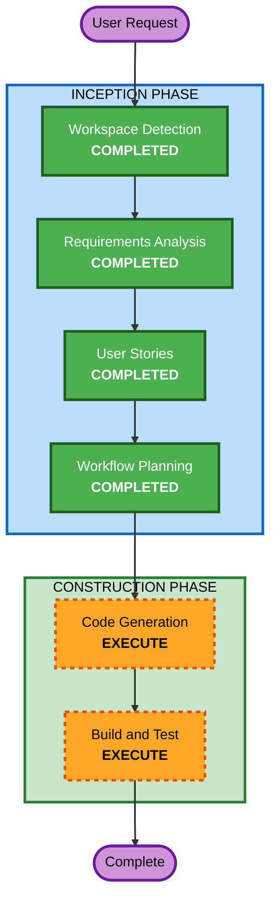

# Execution Plan

## Detailed Analysis Summary

### Change Impact Assessment
- **User-facing changes**: Yes — entire tool is a new user-facing CLI
- **Structural changes**: N/A — greenfield
- **Data model changes**: No — no persistent data (cache is ephemeral)
- **API changes**: No — CLI tool, no API
- **NFR impact**: Yes — static binary, CI targets, tests, linting, security (checksum, TLS, integrity), caching

### Risk Assessment
- **Risk Level**: Low — isolated CLI tool, no production dependencies, no data
- **Rollback Complexity**: Easy — users just delete the installed files
- **Testing Complexity**: Moderate — need to mock HTTP/filesystem for unit tests

## Workflow Visualization

## Phases to Execute

### INCEPTION PHASE
- [x] Workspace Detection (COMPLETED)
- [x] Requirements Analysis (COMPLETED)
- [x] User Stories (COMPLETED)
- [x] Workflow Planning (COMPLETED)
- Reverse Engineering — SKIP (greenfield)
- Application Design — SKIP (single component, no service layer needed)
- Units Generation — SKIP (single unit of work — one CLI binary)

### CONSTRUCTION PHASE
- Functional Design — SKIP (business logic is straightforward: download, extract, copy, patch, cache)
- NFR Requirements — SKIP (NFRs fully captured in requirements.md: static binary, CI, tests, linting, security, caching)
- NFR Design — SKIP (no complex NFR patterns — security and caching are implementation details handled in code generation)
- Infrastructure Design — SKIP (no cloud infrastructure — it's a local CLI tool; CI is GitHub Actions only)
- [ ] Code Generation — EXECUTE (single unit)
- [ ] Build and Test — EXECUTE

### OPERATIONS PHASE
- Operations — PLACEHOLDER (not applicable for a CLI tool distributed via GitHub Releases)

## Success Criteria
- **Primary Goal**: Working CLI binary that installs AI-DLC rules into any project
- **Key Deliverables**:
  - Rust source code with clean module structure
  - Unit tests for core logic (patching, gitignore, cache, integrity)
  - GitHub Actions workflow for cross-platform release builds
  - README.md with installation and usage docs
  - MIT-0 LICENSE
- **Quality Gates**:
  - `cargo test` passes
  - `cargo clippy` — no warnings
  - `cargo fmt --check` — passes
  - Builds successfully on all 5 targets
- **Security Gates**:
  - HTTPS-only downloads with TLS validation
  - SHA-256 checksum verification of downloaded zip
  - Integrity manifest for installed rule files
  - Only downloads from trusted `github.com/awslabs/aidlc-workflows`
